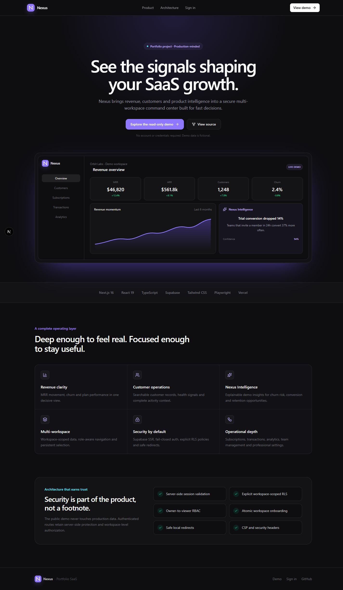
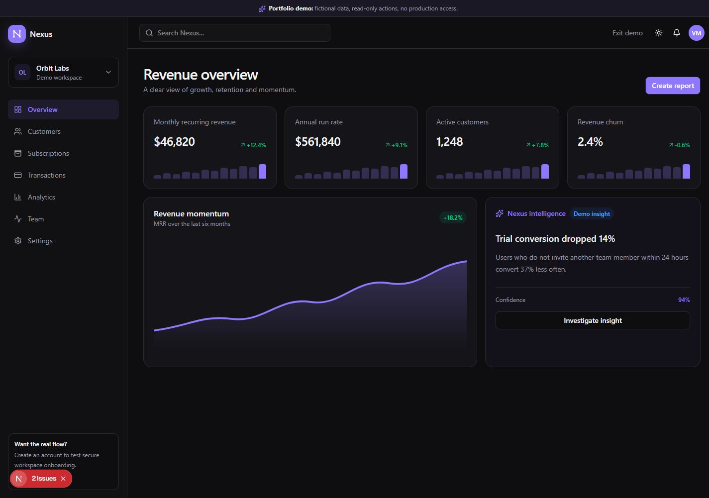
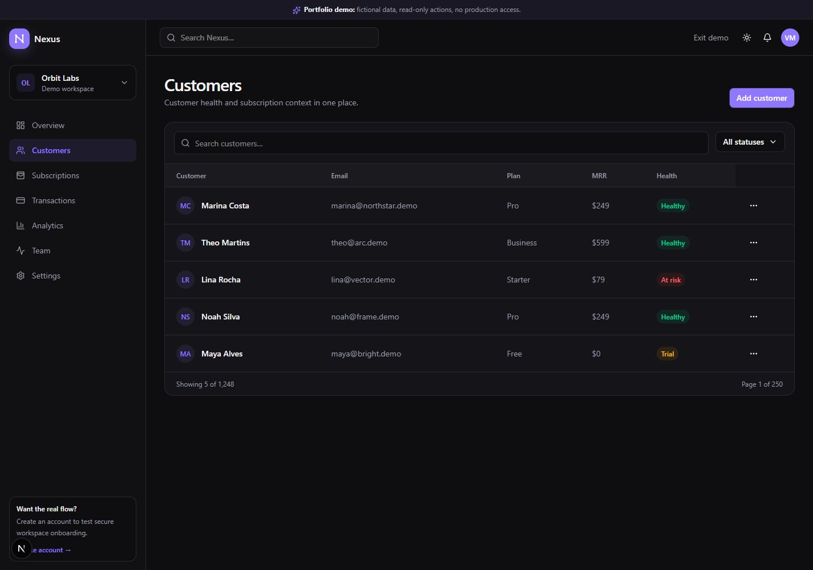
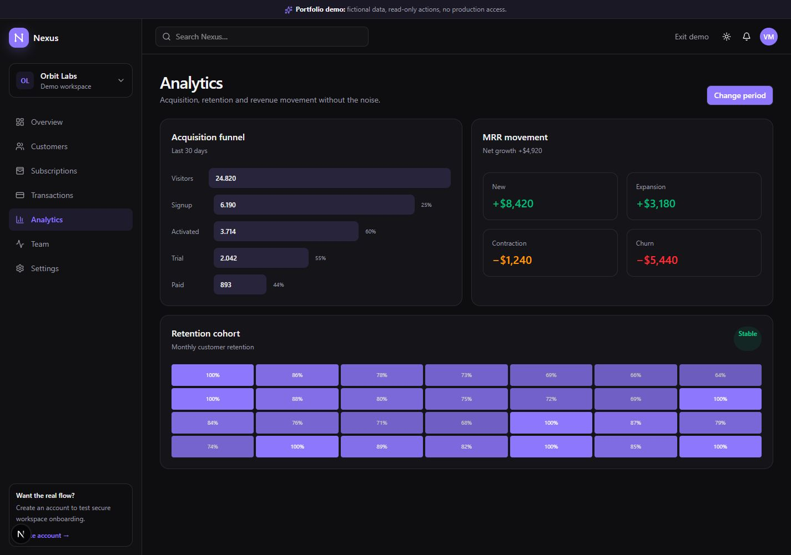
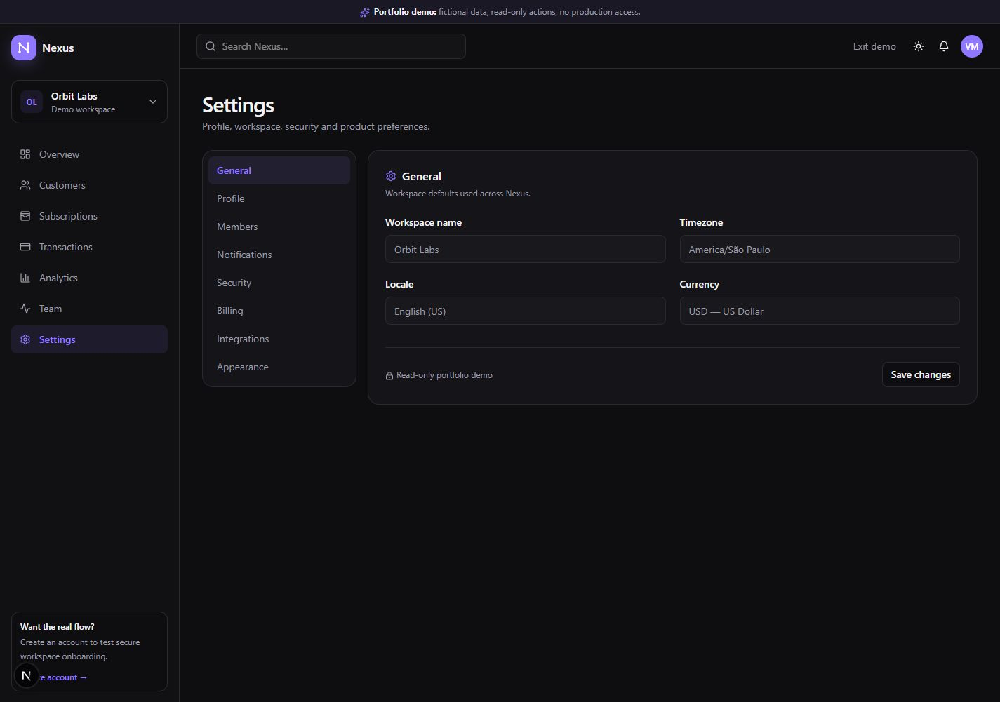
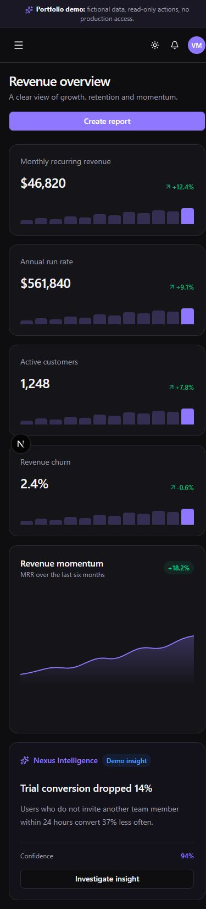

# Nexus — SaaS Revenue Intelligence

> A production-minded, multi-workspace SaaS operations platform for revenue, customers, subscriptions and growth.

[](https://nextjs.org) [](https://www.typescriptlang.org/) [](https://supabase.com/) [](#quality-gates)

[Live product](https://nexus-saas-dashboard-tawny.vercel.app/) · [Read-only demo](https://nexus-saas-dashboard-tawny.vercel.app/demo/dashboard) · [Repository](https://github.com/vitorgamer778/nexus-saas-dashboard)

Nexus is a portfolio SaaS built beyond the typical static dashboard. It combines a concise public product experience with real authentication, workspace-aware authorization, explicit PostgreSQL row-level security, operational data surfaces and a safe public demo that never accesses production records.



## Product tour

The public demo contains fictional data, performs no writes and requires no shared credentials. Every simulated action is clearly marked as read-only. Authenticated routes remain server-protected and fail closed when Supabase is unavailable.



| Customers                                              | Analytics                                         |
| ------------------------------------------------------ | ------------------------------------------------- |
|  |  |

| Settings                                                          | Responsive dashboard                                             |
| ----------------------------------------------------------------- | ---------------------------------------------------------------- |
|  |  |

## What is implemented

- Revenue cockpit with MRR, ARR, active customers, churn, sparklines and trend context
- Nexus Intelligence product surface for explainable demo insights
- Customer search, filtering, pagination, quick view and detailed profiles
- Subscription plan source of truth, plan adoption and revenue distribution
- Transaction filters, status detail, pagination and safe CSV export
- Acquisition funnel, retention cohorts, MRR movement and channel analytics
- Multi-workspace switcher with persisted selection and workspace-scoped queries
- Owner, admin, manager, member and viewer authorization enforced in PostgreSQL
- Professional settings for profile, members, notifications, security, billing, integrations, appearance and critical workspace actions
- Responsive light/dark interface with loading, empty and error states
- Public landing, SEO metadata, Open Graph image, sitemap, robots policy and branded error surfaces

## Architecture

```text
Browser
├── Public product site (/)
├── Isolated read-only demo (/demo/*) ─── fictional in-memory data only
└── Authenticated product (/dashboard, /customers, ...)
        │
        ▼
Next.js 16 App Router
├── Server Components and server-side route protection
├── Server Actions / Route Handlers with authorization checks
├── Focused Client Components for forms, charts and interaction
└── Security headers, safe callbacks and noindex boundaries
        │
        ▼
Supabase
├── Auth + SSR cookie refresh
├── PostgreSQL workspace model
├── Atomic workspace onboarding RPC
└── Explicit SELECT / INSERT / UPDATE / DELETE RLS policies
```

Server Components are the default. Interactive boundaries are intentionally small, and the public demo is architecturally separate from authenticated data access.

## Security model

- Authenticated routes are checked before rendering and again in the server layout
- Missing or invalid Supabase configuration fails closed
- OAuth callback destinations accept safe local paths only
- Business records are scoped by `workspace_id`; RLS is the final security boundary
- Policies are separated by operation and role rather than broad `FOR ALL` rules
- Owner invariants prevent accidental loss of workspace ownership
- Workspace bootstrap is atomic to prevent orphaned tenant state
- No `service_role` key is used in client code
- CSP, clickjacking, MIME sniffing, referrer, permissions and HSTS headers are configured
- Authenticated and authentication pages are excluded from indexing

This is a portfolio project, not an audited billing platform. Connect a payment provider and complete a dedicated security review before processing real payments.

## Stack

Next.js 16 · React 19 · TypeScript · Tailwind CSS 4 · shadcn/Radix · Supabase SSR · PostgreSQL · Recharts · Zod · React Hook Form · Vitest · Playwright · Vercel

## Local setup

Requirements: Node.js 22+ and npm 10+.

```bash
git clone https://github.com/vitorgamer778/nexus-saas-dashboard.git
cd nexus-saas-dashboard
npm install
copy .env.example .env.local
npm run dev
```

Open `http://localhost:3000`. The landing and `/demo/dashboard` work without Supabase configuration. Authenticated routes deliberately redirect to a configuration-safe login state until valid environment values are present.

### Supabase configuration

Apply the migrations in `supabase/migrations/` in timestamp order, then configure only the public browser values:

```env
NEXT_PUBLIC_SUPABASE_URL=https://your-project-ref.supabase.co
NEXT_PUBLIC_SUPABASE_PUBLISHABLE_KEY=sb_publishable_your_key
```

Enable the desired Auth providers and allow `<your-origin>/auth/callback` in Supabase redirect URLs. Keep secret and `service_role` keys out of browser variables, source control and client bundles.

## Quality gates

```bash
npm run lint
npm run typecheck
npm test
npm run build
npm run test:e2e
```

Vitest covers security helpers, analytics, customer health, metrics and exports. Playwright verifies protected-route behavior, safe callbacks, security headers and the public experience on desktop and mobile. GitHub Actions runs the complete gate on Node 22.

## Deployment

The repository is connected to Vercel. Production configuration is managed in the Vercel project environment; pushes to the production branch trigger a deployment after CI validation.

Before deploying a new Supabase environment: apply all migrations, configure the two public Supabase values in Vercel, add the production callback URL in Supabase Auth, run the quality gate, then verify auth, workspace isolation and destructive confirmations.

## Project status

Portfolio release: complete. The current scope intentionally leaves real payment processing, outbound invitation email and AI generation behind clearly labelled integration boundaries.

## License

Released under the [MIT License](LICENSE).
